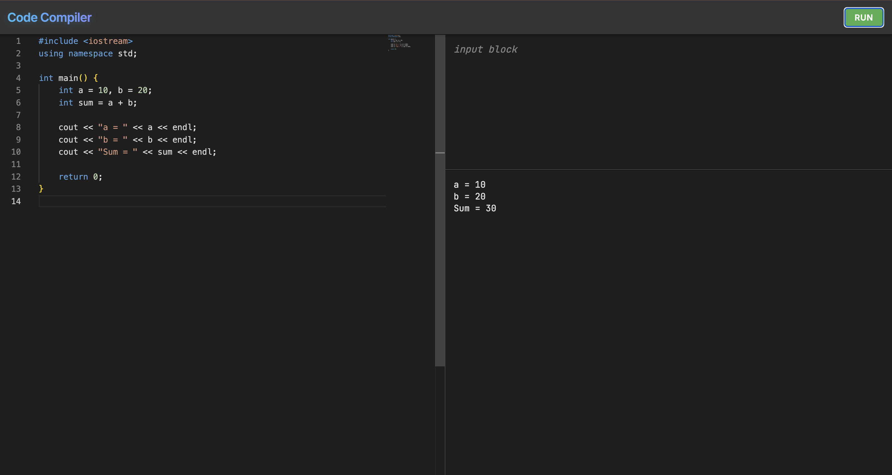

# 💻 Online Code Editor

Welcome to the **Online Code Editor**! This project is a web-based tool that allows you to write and run C++ code directly in your browser.

---

## a. The Problem I am Solving 🎯

For many beginners, starting with programming can be scary. You have to install a "compiler" (software to run code) and an "editor" (software to write code) on your computer. This process—setting up a "local environment"—can be complicated, time-consuming, and prone to errors.

**My project solves this by putting everything on the web.**
*   **No Installation Needed:** You don't need to install anything on your computer.
*   **Instant Coding:** Just open the website, type your code, and click "Run".
*   **Accessible Anywhere:** You can code from any computer that has a browser.

It removes the barrier to entry so students and developers can focus on *learning logic* instead of *fixing installation errors*.


---

## b. How to Run My Program 🚀

The project is split into two parts: the **Backend** (the brain that runs the code) and the **Frontend** (the website you see). You need to start both.

### Prerequisites
Make sure you have **Node.js** installed on your computer.

### Step 1: Start the Backend (Server)
The backend accepts your code and actually compiles it.

1.  Open your terminal.
2.  Go into the backend folder:
    ```bash
    cd Backend
    ```
3.  Install the necessary tools (dependencies):
    ```bash
    npm install
    ```
4.  Turn on the server:
    ```bash
    npm start
    ```
    *(You should see a message saying the server started, usually on port 8080)*

### Step 2: Start the Frontend (Website)
The frontend is the editor where you type.

1.  Open a **new** terminal window (keep the other one running!).
2.  Go into the frontend folder:
    ```bash
    cd FrontEnd
    ```
3.  Install the necessary tools:
    ```bash
    npm install
    ```
4.  Launch the website:
    ```bash
    npm run dev
    ```
5.  **Done!** Look at the terminal for a link (like `http://localhost:5173`), click it, and you can start coding.

---

## c. A Brief Explanation of My Design Decisions 🛠️

I built this project using a "Client-Server" architecture. Think of it like a restaurant: the **Frontend** is the menu and table where you sit, and the **Backend** is the kitchen where the food is cooked.

### 1. Separation of Concerns (Frontend vs. Backend)
I kept the website (Frontend) separate from the logic (Backend).
*   **Why?** It keeps things organized. If I want to change how the buttons look, I only touch the Frontend. If I want to upgrade the compiler, I only touch the Backend. They talk to each other but don't interfere with each other.

### 2. The Frontend: React & Vite
*   **React:** I used React because it allows me to build a website that feels like an app. It updates instantly without reloading the page.
*   **Monaco Editor:** Instead of a simple text box, I used the *Monaco Editor*. This is the same powerful editor used in VS Code. It gives you helpful features like colorful text (syntax highlighting) and line numbers, making it much easier to read and write code.
*   **Vite:** This is a tool to run the website. I chose it because it is extremely fast, making development smooth.

### 3. The Backend: Node.js & Express
*   **Node.js:** This allows me to use JavaScript (the same language as the frontend) for the server. It simplifies things because I don't need to switch languages.
*   **Express:** This handles the "requests". When you click "Run" on the frontend, Express catches that request, sends your code to the compiler, and sends the result back to you.

### 4. Code Compilation
When you run code, the backend actually saves your code to a temporary file, runs a real C++ command line tool (like `g++`), captures the output, and cleans up. This ensures the code runs exactly as it would on a real computer.
