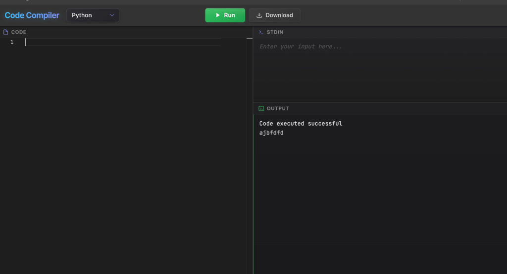

# 💻 Scalable Online Code Execution Engine

A robust, full-stack web application designed for secure and scalable code execution. Users can write, compile, and run code in multiple programming languages directly from their browser, with execution isolated in secure Docker containers.



---

## 🎯 Project Overview

This project solves the "Local Setup Barrier" for aspiring developers. By providing a browser-based IDE coupled with a scalable backend execution engine, it eliminates the need for users to install compilers or configure local environments. 

Beyond simple code execution, this system implements professional engineering practices:
- **Asynchronous Execution:** Uses a job queue to handle heavy tasks without blocking the web server.
- **Security through Isolation:** Executes user-provided (untrusted) code inside ephemeral Docker containers.
- **Resource Management:** Strictly limits CPU, memory, and execution time to prevent system abuse.

---

## 🛠️ Tech Stack

### Frontend
- **React.js & Vite:** Modern, high-performance UI framework.
- **Monaco Editor:** The powerhouse behind VS Code, providing features like syntax highlighting and intelligent indentation.
- **Vanilla CSS:** Custom, sleek dark-themed UI for a premium developer experience.

### Backend
- **Node.js & Express:** Lightweight and fast server-side runtime.
- **BullMQ & Redis:** High-performance message queue for reliable asynchronous task processing.
- **Docker:** Containerization for secure, isolated, and reproducible code execution.
- **Python Shell:** Bridging logic for specific language execution paths.
- **Winston & Morgan:** Professional logging and monitoring.

---

## ✨ Key Features

- **Multi-Language Support:** Write and execute code in Python, Java, C++, C, and JavaScript.
- **Isloated Execution:** Every execution run happens in a clean, sandboxed Docker container with `--network none` for security.
- **Custom Stdin:** Provide input to your programs dynamically through a dedicated stdin panel.
- **Download Code:** Save your code locally with the correct file extension (.py, .cpp, .java, etc.) at the click of a button.
- **Premium IDE Experience:** A distraction-free, VS Code-like editor built with Monaco, featuring syntax highlighting and auto-indentation.
- **Queue Management:** Leverages Redis-backed BullMQ to manage high execution loads and ensure server stability.
- **Resource Constraints:** Strict limits on CPU (0.5 vCPU), Memory (128MB), and Timeout (5s) to guarantee fair usage.
- **Smooth Visuals:** Modern, dark-themed UI with loading spinners and interactive components.

---

## 🚀 How to Run Locally

### Prerequisites
- **Node.js** (v16+)
- **Docker** (Desktop or Engine)
- **Redis Server** (Running locally or on a cloud instance)

### Step 1: Backend Setup
1. Navigate to the `Backend` directory:
   ```bash
   cd Backend
   ```
2. Create a `.env` file:
   ```env
   PORT=8080
   REDIS_HOST=127.0.0.1
   REDIS_PORT=6379
   ```
3. Install dependencies:
   ```bash
   npm install
   ```
4. Start the server:
   ```bash
   npm start
   ```

### Step 2: Frontend Setup
1. Open a new terminal and navigate to the `FrontEnd` directory:
   ```bash
   cd FrontEnd
   ```
2. Install dependencies:
   ```bash
   npm install
   ```
3. Launch the development server:
   ```bash
   npm run dev
   ```
4. Access the application at `http://localhost:5173`.

---

## 🏗️ System Architecture

1. **Client (Frontend):** Sends code and input to the API server.
2. **API Server (Backend):** Validates the request and adds a job to the **BullMQ** queue.
3. **Queue (Redis):** Stores jobs until a worker is available.
4. **Worker:** Picks up the job, creates a temporary execution environment, and spawns a **Docker** container.
5. **Docker Container:** Compiles/Executes the code in a sandbox and returns the output.
6. **Result:** Worker captures the output and sends it back to the client via the job completion event.

---

## 🛠️ Design Decisions & Lessons Learned

- **Why BullMQ?** To ensure the server remains responsive even under heavy load. By offloading execution to a queue, we can scale workers independently.
- **Why Docker?** Security is paramount when running untrusted code. Docker provides the best balance of isolation and performance for this use case.
- **Why Monaco Editor?** Providing a "VS Code-like" experience significantly improves user retention and makes the tool feel professional.

---

## 👨‍💻 Author
**Mohd Anas**  
*Aspiring Software Engineer*

